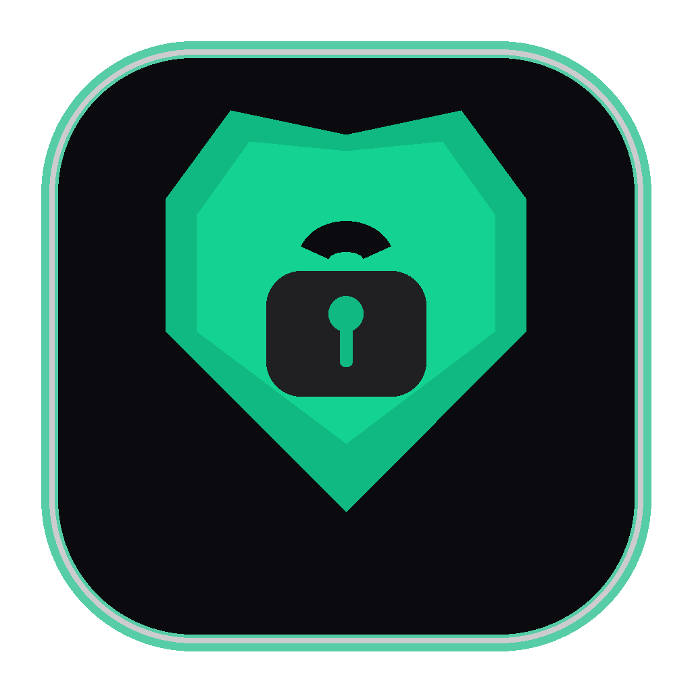
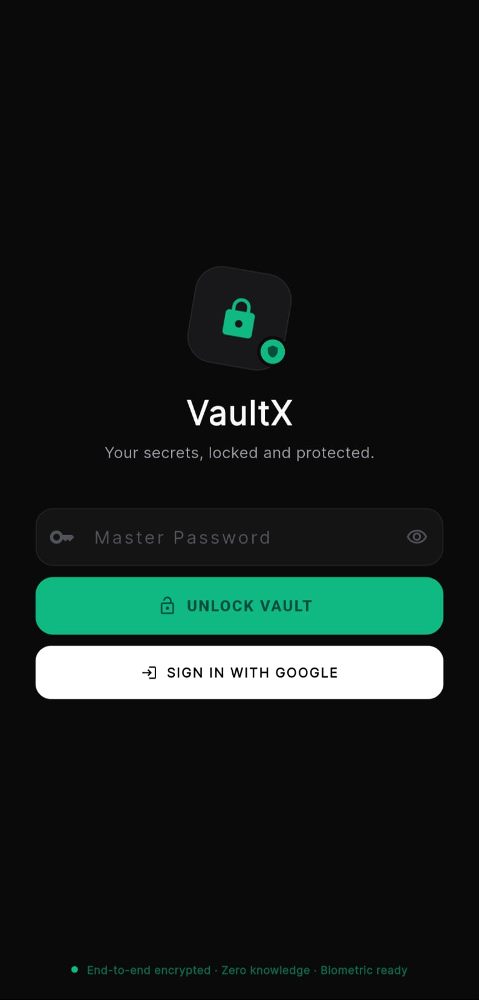
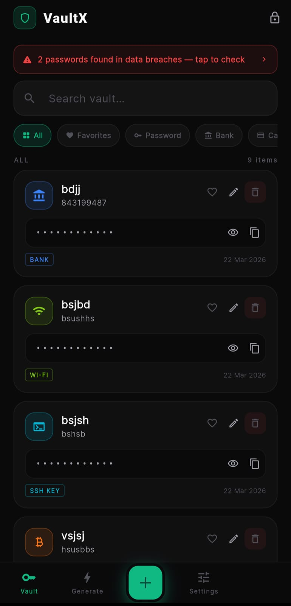
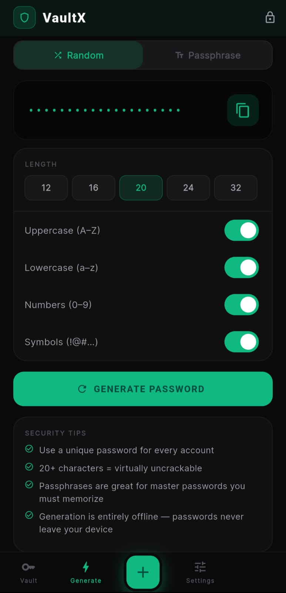
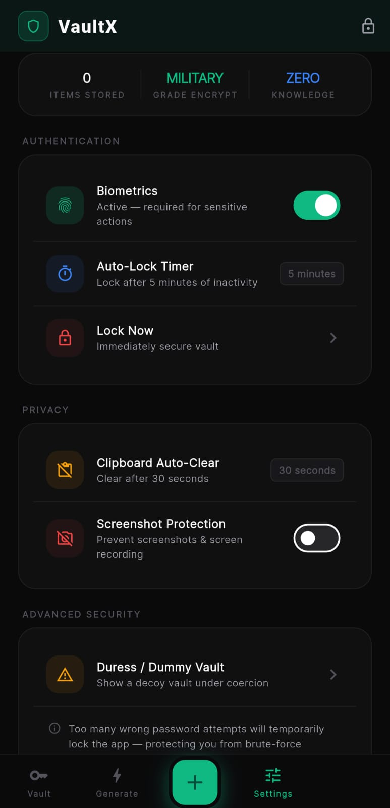

<div align="center">



# VaultX

### Military-Grade Password Manager · Built with Flutter

[](https://flutter.dev)
[](https://dart.dev)
[](LICENSE)
[](https://github.com)
[](https://github.com)
[](https://github.com/yourusername/vaultx/stargazers)

**VaultX** is a zero-knowledge, end-to-end encrypted password manager for Android and iOS.  
Every credential is encrypted on your device before it ever touches storage or the network.  
Not even the developer can read your data.

[✦ Features](#-features) · [✦ Security](#-security-architecture) · [✦ Screenshots](#-screenshots) · [✦ Getting Started](#-getting-started) · [✦ Roadmap](#-roadmap) · [✦ Sponsor](#-sponsor-this-project)

---

</div>

## Why VaultX?

The password manager market is dominated by closed-source, subscription-based products that ask you to **trust them** with your most sensitive data. VaultX takes a different approach:

- **Open source** — every line of encryption logic is auditable
- **Zero-knowledge** — your master password never leaves your device
- **No subscription** — free and self-hostable cloud sync via Firebase
- **No ads, no tracking** — the app has a single purpose: keeping your data safe
- **Duress vault** — shows a decoy vault under coercion, indistinguishable from the real one

---

## ✦ Features

### Security
| Feature | Details |
|---|---|
| **AES-256-GCM Encryption** | Authenticated encryption — detects tampering, not just encrypts |
| **PBKDF2-SHA256 Key Derivation** | 10,000 iterations with a unique random salt per vault |
| **Zero-Knowledge Architecture** | Master password derived key never stored or transmitted |
| **Hardware-Backed Storage** | iOS Keychain (Secure Enclave) / Android Keystore (TEE/StrongBox) |
| **Biometric Authentication** | Face ID, Touch ID, Fingerprint — required for sensitive actions |
| **Duress Vault** | Decoy vault opened by a separate password — identical UI, different data |
| **Screenshot Protection** | System-level FLAG_SECURE on Android, blur overlay on iOS |
| **Clipboard Auto-Wipe** | Configurable timer (15s / 30s / 1min) wipes clipboard on copy |
| **Exponential Lockout** | 3 attempts → 30s · 5 → 5min · 7 → 1hr · 10+ → 24hr |
| **Auto-Lock** | Inactivity timer locks vault — never locks during active save |
| **Breach Detection** | HaveIBeenPwned k-anonymity API — only 5 hash chars sent |

### Vault
| Feature | Details |
|---|---|
| **8 Entry Categories** | Password, Bank, Credit Card, Identity, Secure Note, Crypto, SSH Key, Wi-Fi |
| **Built-in TOTP / 2FA** | RFC 6238 compliant — replaces Google Authenticator |
| **Password Generator** | Cryptographically random passwords and passphrases |
| **Strength Analyser** | Entropy, crack time estimate, improvement suggestions |
| **Password Age Warnings** | Flags passwords older than 90 days |
| **Favourites & Filters** | Category filters, favourites, full-text search |
| **Secure Notes** | Encrypted freeform notes with no character limit |

### Cloud & Sync
| Feature | Details |
|---|---|
| **Optional Cloud Backup** | Firebase Firestore — encrypted before upload |
| **Google Sign-In** | Native account picker — no browser redirect |
| **Smart Merge Sync** | Last-write-wins per entry — no data ever deleted on sync |
| **Restore & Merge** | Cloud restore merges with local vault, not overwrites |

---

## ✦ Security Architecture

```
┌─────────────────────────────────────────────────────────┐
│                     USER INPUT                          │
│                  Master Password                        │
└──────────────────────┬──────────────────────────────────┘
                       │
                       ▼
┌─────────────────────────────────────────────────────────┐
│              KEY DERIVATION (device only)               │
│         PBKDF2-SHA256 · 10,000 iterations               │
│         Random 128-bit salt per vault                   │
│         256-bit AES key output                          │
└──────────────────────┬──────────────────────────────────┘
                       │
                       ▼
┌─────────────────────────────────────────────────────────┐
│                  ENCRYPTION                             │
│         AES-256-GCM (authenticated)                     │
│         Random 96-bit IV per operation                  │
│         128-bit authentication tag                      │
└──────────────────────┬──────────────────────────────────┘
                       │
          ┌────────────┴────────────┐
          ▼                         ▼
┌──────────────────┐     ┌──────────────────────────────┐
│  LOCAL STORAGE   │     │       CLOUD STORAGE          │
│  Android         │     │  Firebase Firestore          │
│  Keystore (TEE)  │     │  (ciphertext only — server   │
│  iOS Keychain    │     │   never sees plaintext)      │
│  (Secure Enclave)│     └──────────────────────────────┘
└──────────────────┘
```

**Threat model:** An attacker with full access to the device storage, the cloud database, and the source code still cannot decrypt vault data without the master password. There are no backdoors, no recovery keys, and no server-side decryption.

---

## ✦ Screenshots

| Lock Screen | Vault | Generator | Settings |
|:-----------:|:-----:|:---------:|:--------:|
|  |  |  |  |

---

## ✦ Getting Started

### Prerequisites

- Flutter 3.22+ ([install guide](https://docs.flutter.dev/get-started/install))
- Android Studio or VS Code
- A Firebase project ([free tier](https://firebase.google.com))

### Clone & Install

```bash
git clone https://github.com/yourusername/vaultx.git
cd vaultx
flutter pub get
```

### Firebase Setup (required for cloud sync)

1. Go to [Firebase Console](https://console.firebase.google.com) → Create project
2. Add an Android app → download `google-services.json` → place at `android/app/`
3. Add an iOS app → download `GoogleService-Info.plist` → place at `ios/Runner/`
4. Enable **Google Sign-In** under Authentication → Sign-in method
5. Create a **Firestore database** in production mode with these rules:

```javascript
rules_version = '2';
service cloud.firestore {
  match /databases/{database}/documents {
    match /vaults/{userId} {
      allow read, write: if request.auth != null
                         && request.auth.uid == userId
                         && request.resource.size() < 5242880;
    }
  }
}
```

6. Run FlutterFire configure:

```bash
dart pub global activate flutterfire_cli
dart pub global run flutterfire_cli:flutterfire configure --project=YOUR_PROJECT_ID
```

### Run

```bash
flutter run
```

### Build Release APK

```bash
# First time: create your signing keystore
keytool -genkey -v -keystore android/app/vaultx.keystore \
  -alias vaultx -keyalg RSA -keysize 2048 -validity 10000

# Create android/key.properties with your keystore credentials
# Then build:
flutter build apk --release
```

APK output: `build/app/outputs/flutter-apk/app-release.apk`

---

## ✦ Project Structure

```
lib/
├── main.dart                    # App entry, routing, lifecycle
├── firebase_options.dart        # ⚠️ Not committed — generate with flutterfire
├── models/
│   └── vault_entry.dart         # VaultEntry, VaultConfig, VaultState models
├── services/
│   ├── crypto_service.dart      # AES-256-GCM + PBKDF2, TOTP, breach check
│   ├── storage_service.dart     # flutter_secure_storage + lockout logic
│   ├── biometric_service.dart   # local_auth wrapper
│   └── vault_provider.dart      # All app state — ChangeNotifier
├── screens/
│   ├── onboarding_screen.dart   # First-launch setup + master password
│   ├── lock_screen.dart         # Unlock, Google Sign-In, restore
│   ├── vault_screen.dart        # Entry list, search, filters, breach badges
│   ├── generator_screen.dart    # Password/passphrase generator
│   └── settings_screen.dart     # Security, privacy, cloud settings
├── widgets/
│   ├── add_edit_modal.dart      # Add/edit bottom sheet — all 8 categories
│   └── vaultx_alert.dart        # Alert dialog + biometric overlay
└── utils/
    └── theme.dart               # Design system, colours, shared widgets
```

---

## ✦ Tech Stack

| Layer | Technology |
|---|---|
| **Framework** | Flutter 3.22 / Dart 3.4 |
| **Encryption** | PointyCastle (BouncyCastle Dart port) — AES-256-GCM + PBKDF2-SHA256 |
| **Secure Storage** | flutter_secure_storage → Android Keystore / iOS Keychain |
| **Biometrics** | local_auth 2.x — Face ID, Fingerprint, Iris |
| **State Management** | Provider (ChangeNotifier) |
| **Cloud** | Firebase Auth + Cloud Firestore |
| **Background Crypto** | Dart Isolates — all crypto off the main thread |
| **Breach API** | HaveIBeenPwned v3 (k-anonymity range query) |

---

## ✦ Roadmap

### v2.1 — Planned
- [ ] Password import (CSV, Bitwarden JSON, 1Password export)
- [ ] Password export (encrypted JSON)
- [ ] Browser autofill integration (Android autofill service)
- [ ] Password sharing between trusted contacts (end-to-end encrypted)
- [ ] Dark / Light / AMOLED theme options

### v2.2 — Planned  
- [ ] Desktop support (Windows / macOS) — Flutter desktop
- [ ] Web vault (read-only) — Flutter web
- [ ] Secure document storage (encrypted file attachments)
- [ ] Argon2id key derivation upgrade (more GPU-resistant than PBKDF2)
- [ ] Firebase App Check (prevents API key abuse)
- [ ] Passkey / FIDO2 support

### v3.0 — Vision
- [ ] Self-hosted sync server (alternative to Firebase)
- [ ] Team vaults with role-based access
- [ ] Enterprise MDM policies
- [ ] SOC 2 / ISO 27001 compliance pathway

---

## ✦ Contributing

Contributions are welcome, especially in these areas:

**Security review** — If you find a vulnerability, please open a private security advisory rather than a public issue. Details in [SECURITY.md](SECURITY.md).

**Feature development** — Open an issue to discuss before building. Check the roadmap for priorities.

**Testing** — Unit tests for crypto logic live in `test/crypto_service_test.dart`. Integration tests are a high priority contribution.

**Translation** — The app currently supports English only. l10n contributions welcome.

```bash
# Run tests
flutter test

# Run with verbose output
flutter test --reporter expanded
```

---

## ✦ Sponsor This Project

VaultX is free, open source, and built without VC funding or investor pressure. If this project is useful to you or aligns with your values around **digital privacy, security, and user autonomy** — consider sponsoring.

### What sponsorship funds

| Priority | Item |
|---|---|
| 🔐 | Independent security audit by a certified cryptographer |
| 🧪 | Comprehensive automated test suite (unit + integration + E2E) |
| 🌐 | Self-hosted sync server — eliminate Firebase dependency |
| 🖥️ | Desktop and web client development |
| 📱 | Play Store and App Store publishing fees and maintenance |
| 🔑 | Argon2id upgrade for stronger key derivation |

### Sponsor tiers

**☕ Individual — $5/month**  
Your name in the README contributors section. Eternal gratitude.

**🛡️ Supporter — $25/month**  
Named in the app's About section. Input on roadmap priorities.

**🏢 Organisation — $100/month**  
Logo in README. Priority issue handling. Recognition as a security-first organisation. Direct line for feature requests.

**🔬 Security Partner — $500/month**  
Co-fund the independent security audit. Your organisation credited in the audit report. Early access to security findings.

---

## ✦ Security Policy

Found a vulnerability? Please **do not** open a public GitHub issue.

Instead, use [GitHub's private security advisory](https://github.com/sk511/vaultx/security/advisories/new) to report it confidentially. All reports are acknowledged within 48 hours.

See [SECURITY.md](SECURITY.md) for the full responsible disclosure policy.

---

## ✦ License

MIT License — see [LICENSE](LICENSE) for details.

You are free to use, modify, and distribute this software. If you build a commercial product on top of VaultX, please consider [sponsoring](#-sponsor-this-project) the project.

---

## ✦ Acknowledgements

- [PointyCastle](https://pub.dev/packages/pointycastle) — Dart port of BouncyCastle, the cryptographic foundation of VaultX
- [HaveIBeenPwned](https://haveibeenpwned.com) — Troy Hunt's breach database, used with k-anonymity to protect user privacy
- [Flutter](https://flutter.dev) — Google's cross-platform UI toolkit
- [Firebase](https://firebase.google.com) — Cloud infrastructure for optional sync

---

<div align="center">

**Built with care for people who take privacy seriously.**

If VaultX matters to you, give it a ⭐ — it helps more people find it.

[](https://github.com/sk511/vaultx/stargazers)

</div>
